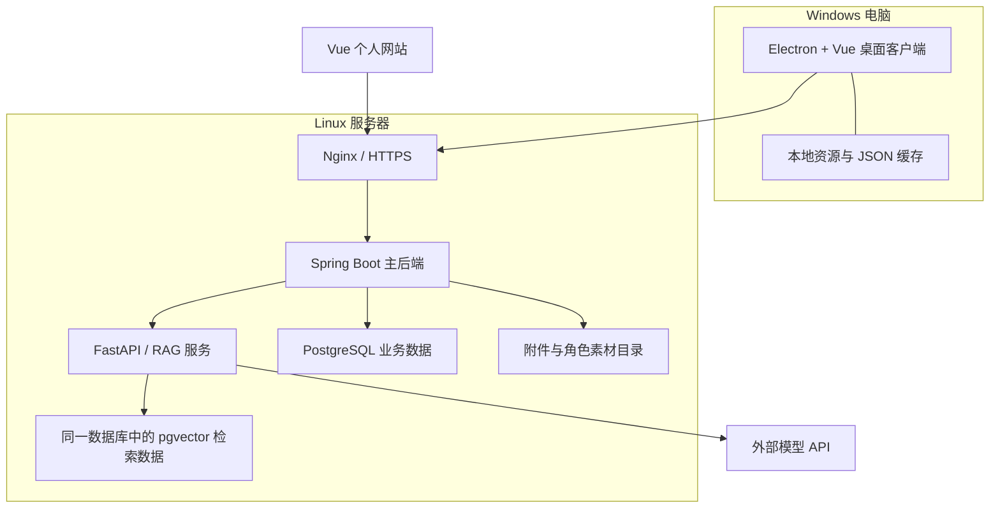

# 桌面猫个人助手：技术栈与架构

文档版本：v1.0
更新日期：2026-09-17
阶段：个人文章 CRUD、文章温馨回忆轮播、每日情绪站、一次性待办提醒和 Windows 桌面猫已可运行；图片回忆、重复提醒与 RAG 保持规划状态。

本文区分当前已实现部分与后续规划。用户已明确选择 Spring Boot 3、JDK 21 和原生 MyBatis。本次实际运行环境为 Oracle GraalVM JDK 21.0.12、Node.js 24.16.0、pnpm 11.19.0、Maven 3.9.15，数据库集成验证使用 PostgreSQL 16.13。启动方式与当前范围见 README.md；个人文章、每日情绪和一次性待办提醒数据库业务已经实现，Python AI 服务和云端部署仍未实施。

## 1. 项目定位与范围

以自己的小猫为原型，制作一个结合桌面陪伴、个人记录和 RAG 知识库的私人助手。首先服务自己的长期使用，同时用于学习前后端、桌面开发、AI 检索与部署，并逐渐积累真实的项目经验。

| 部分 | 当前确定的功能 |
| --- | --- |
| 桌面小猫 | Q 版形象、猫叫、摸头、喂冻干、睡觉、拖动、托盘、登录系统后自动启动 |
| 日常助手 | 已实现每日情绪快速记录、未完成事项和一次性时间提醒；重复提醒与文字对话后续实现 |
| 个人网站 | 日记、心得、实习笔记、照片、喜欢的话和个人设置 |
| 回忆陪伴 | 轮播用户主动收藏的温馨回忆与语句，可暂停、静音和调整节奏 |
| RAG 知识库 | 检索个人记录、生成有依据的答案、展示引用并跳回原文 |

喂食与陪伴不绑定任务完成奖励。记录是否允许检索、是否加入回忆轮播分别设置。尚未明确的功能只保留接入位置。

## 2. 总体架构

采用一个 Windows 桌面客户端、一个个人网站、一个 Java 主后端和一个 Python AI 服务。云端初期部署在一台 Linux 服务器上，Java 内部按业务模块组织。



职责边界：

- 桌面端负责小猫展示、交互、系统功能及本地提醒。
- 网站负责完整的记录、整理、检索与设置界面。
- Java 负责原始记录、任务状态、用户设置、访问控制及 AI 业务编排。
- Python 负责内容处理、分块、向量化、检索和回答生成。
- Java 与 Python 使用同一 PostgreSQL 实例中的不同数据区域，各自管理所属数据；Python 不直接修改日记、待办等业务事实。
- 客户端统一访问 Java，由 Java 调用内部 Python 服务。

## 3. 前端与桌面端

| 技术 | 选定版本 | 职责 |
| --- | --- | --- |
| Node.js | 24 LTS；当前使用 24.16.0 | 开发与构建运行环境 |
| pnpm | 11.19.0 | 依赖管理与前端工作区 |
| Vue | 3.5.42 | 网站和桌面界面 |
| TypeScript | 5.9.3 | 数据类型、接口与交互代码；作为兼容基线，并非最新版本声明 |
| Vite | 7.3.6 | 开发服务与前端构建 |
| Vue Router | 5.3.1 | 网站和助手面板路由 |
| Pinia | 4.0.3 | 登录状态、待办、偏好等前端状态 |
| Electron | 44.3.0 | 桌面窗口、托盘、自动启动、通知与系统交互 |
| electron-vite | 5.0.0 | 构建主进程、preload 和渲染进程 |
| electron-builder | 26.16.1 | Windows NSIS 安装包 |

版本依据：[Node.js](https://nodejs.org/en/download)、[pnpm](https://github.com/pnpm/pnpm/releases/tag/v11.10.0)、[Vue](https://github.com/vuejs/core/releases)、[TypeScript](https://github.com/microsoft/TypeScript/releases)、[Vite](https://github.com/vitejs/vite/releases/tag/v7.3.6)、[Vue Router](https://github.com/vuejs/router/releases)、[Pinia](https://github.com/vuejs/pinia/releases)、[Electron](https://releases.electronjs.org/)、[electron-builder](https://github.com/electron-userland/electron-builder/releases)。

electron-vite 5.0.0 的依赖范围包含 Vite 7；Vite 7.3 仍接收重要修复及安全补丁。因此网站和桌面端统一使用 Vite 7.3.6。参考：[electron-vite 依赖声明](https://raw.githubusercontent.com/alex8088/electron-vite/v5.0.0/package.json)、[Vite 维护策略](https://vite.dev/releases)。

### 界面与小猫实现

- 界面使用自定义 Vue 组件、CSS 变量和主题配置，按实际页面需要制作公共组件。
- 当前角色根据自己的黑猫照片生成，使用两张经过透明化和缩放的 Q 版 PNG，保留纯黑毛、圆脸、厚爪与琥珀眼等特征。
- 当前实现发呆、睡觉、舔毛、玩耍、吃冻干、散步和奔跑七种状态。每项活动按自身范围随机持续，结束后自主选择不同的下一项；用户单击小猫打开活动面板，请求有按状态配置的拒绝概率和对应反馈。
- 玩耍、散步和奔跑由 Electron 主进程按不同速度控制整个透明窗口移动，定期随机改变方向并在当前显示器工作区边缘折返。选择活动和人工拖动期间暂停自动移动，结束后从新位置继续。
- 猫叫已由 Web Audio 合成音替换为本地真实猫叫 MP3，不读取麦克风，也不在运行时请求网络。素材采用 CC0 许可，来源记录在 `apps/desktop/THIRD_PARTY_NOTICES.md`。
- 当前七种状态通过多组透明 PNG 与不同 CSS 动画、毛球、脚印、星光和睡眠符号表达。后续角色包可增加各活动专属动作帧或序列图。
- 摸头、选择吃冻干活动与基础动画均在本地完成，不依赖模型请求；拖拽投喂冻干仍是后续交互。
- Electron 主进程负责窗口、文件、通知等系统能力；Vue 渲染进程通过 preload 暴露的明确方法与主进程通信，启用上下文隔离。
- 当前已实现透明区域的鼠标穿透、拖动、托盘显隐与退出、单实例运行和窗口位置记忆；桌面窗口由 280×320 缩小到 220×220。
- 当前可从活动面板打开单一文本框记录情绪：Enter 发送、Shift+Enter 换行，保存成功只显示“记下了”，失败时在本地保留草稿。渲染进程经 preload 调用主进程，再由主进程请求 Java 接口。
- 当前会在主进程每 30 秒同步未完成提醒、每 5 秒检查到期事项；到期后显示小猫、播放猫叫并给出“我做完了”操作。提醒缓存和已展示版本保存在用户目录，恢复联网或系统唤醒时会立即重新同步。
- 暂停或隐藏时降低动画活动，避免陪伴组件持续产生无意义的渲染开销。

系统能力依据：[Electron 上下文隔离](https://www.electronjs.org/docs/latest/tutorial/context-isolation)、[透明窗口](https://www.electronjs.org/docs/latest/tutorial/custom-window-styles)、[鼠标交互](https://www.electronjs.org/docs/latest/tutorial/custom-window-interactions)。

桌面端当前用 JSON 保存窗口位置、未完成提醒和已经展示的提醒版本，均由主进程统一读写。照片、动画和声音使用普通文件缓存。完整离线编辑尚未纳入第一版，不提前引入本地数据库。

开发机器的 Node.js 和 Electron 内置 Node.js 是两个运行环境。安装包包含桌面运行所需组件，日常使用不需要单独安装 Node.js 或打开开发工具。

## 4. Java 主后端：原生 MyBatis

| 技术 | 选定版本／管理方式 | 职责 |
| --- | --- | --- |
| Java | JDK 21；当前使用 Oracle GraalVM 21.0.12 | 后端运行环境，按普通 JVM 方式启动 |
| Spring Boot | 3.5.16 | Java 主应用 |
| Maven | 3.9.15，使用 Maven Wrapper | 构建与依赖管理 |
| MyBatis Spring Boot Starter | 3.0.5 | 集成原生 MyBatis 与 Spring Boot 3 |
| MyBatis | 3.5.19，由 Starter 默认引入 | SQL 映射与数据库访问 |
| MyBatis-Spring | 3.0.5，由 Starter 默认引入 | Spring 事务与 Mapper 集成 |
| Spring Security | 后续接入时由 Boot 3.5.16 管理 | 登录与访问控制；本次未引入 |
| Flyway | 由 Boot 3.5.16 管理 | 数据库版本迁移；已执行 V1、V2、V3、V4 |
| Validation、日志、Actuator | 由 Boot 3.5.16 管理 | 参数校验、日志、健康检查 |

明确采用原生 MyBatis，不使用 MyBatis-Plus。使用 `org.mybatis.spring.boot:mybatis-spring-boot-starter:3.0.5`，不重复手工添加不同版本的 MyBatis 核心和 MyBatis-Spring。

Starter 3.0.5 以 Spring Boot 3.5 为基线，默认使用 MyBatis 3.5.19 和 MyBatis-Spring 3.0.5。来源：[Starter 发布信息](https://github.com/mybatis/spring-boot-starter/releases/tag/mybatis-spring-boot-3.0.5)、[Boot 3.5 兼容要求](https://docs.spring.io/spring-boot/3.5/system-requirements.html)。

当前 `postgres` 配置连接 PostgreSQL，并由 Flyway 管理 `cat_profile`、`personal_record`、`daily_emotion` 与 `reminder`；`local` 配置关闭数据源自动配置，用于不依赖数据库的基础开发。四个业务模块均已使用 MyBatis 接口和 XML 完成真实数据库读写。

运行环境依据：[Temurin](https://adoptium.net/support/)、[Spring Boot 兼容要求](https://docs.spring.io/spring-boot/system-requirements.html)、[Maven](https://maven.apache.org/download.cgi)。

### 分层与数据访问约定

- 分层固定为 Controller → Service 接口 → Service Impl → DAO 接口 + Mapper XML，DAO 不建立 Impl。
- 各业务模块的请求和返回对象放在模块级 `dto`；Controller 直接把 DTO 交给 Service，不维护内容重复的接口 DTO 和业务 DTO。Service Impl 负责业务编排、状态校验、事务以及 DTO 与 DO 之间的转换；DO 与对应的 Dao 接口放在同一 `dao` 包，SQL 统一放与 Dao 同名的 Mapper XML。
- 使用 MyBatis 动态 SQL，复用公共过滤片段；分页查询与计数保持条件一致。
- 优先核查并复用已有 Mapper、DAO 和同类代码，避免为单个场景重复封装。
- 新增 Mapper／DAO 方法或自定义 SQL 仍须遵守用户已有约定，先提供无法复用的原因、方案与范围，获得明确批准后再实施。选择原生 MyBatis 不代表已批准具体 SQL 方案。
- 不新建异常类，复用已有异常机制。项目中存在 TAssert 时先查看实际定义再使用，不假设其 API；尚未建立的项目基础能力不视为已经存在。

记录、文章回忆、每日情绪和一次性待办提醒模块已经实现；重复提醒、用户设置、文件、AI 编排和鉴权仍按后续需求设计。

## 5. Python AI 服务与 RAG

| 技术 | 选定版本／管理方式 | 职责 |
| --- | --- | --- |
| Python | 3.13.15 | AI 服务运行环境 |
| FastAPI | 0.141.1 | 内部 HTTP API |
| Pydantic | 2 系列，补丁版本待首次解析锁定 | 输入与输出校验 |
| SQLAlchemy | 2 系列，补丁版本待首次解析锁定 | 检索数据访问 |
| psycopg | 3 系列，补丁版本待首次解析锁定 | PostgreSQL 驱动 |
| HTTPX | 具体版本待首次解析锁定 | 模型 HTTP 调用 |
| uv | 工具版本待环境初始化锁定，提交 uv.lock | 环境与依赖管理 |

版本依据：[Python](https://www.python.org/downloads/)、[FastAPI](https://pypi.org/project/fastapi/)。

初期直接组织分块、检索和生成流程，便于理解和评估每一步；暂不把 LangChain、LlamaIndex 作为基础依赖。

### 模型接入基线

| 能力 | 初始选择 |
| --- | --- |
| 对话、摘要、基于记录回答 | 阿里云百炼 qwen-plus |
| 文本向量化 | text-embedding-v4，1024 维 |
| 图片生成、语音合成 | 接口位置预留，实际功能明确后选型 |

参考：[对话 API](https://help.aliyun.com/zh/model-studio/qwen-api-via-openai-chat-completions)、[向量 API](https://help.aliyun.com/en/model-studio/text-embedding-synchronous-api)。

模型地址与标识通过配置管理，密钥保存在服务器。上述模型是初始评测基线，效果要用个人资料验证。服务模型标识不视为永久不变的快照，效果实验需记录模型、参数与数据版本。向量模型改变时重建对应索引，即使维度相同也不能混用。

### 数据流

记录入库：客户端 → Java 保存原文和索引任务 → 后台调用 Python → 按标题和段落分块 → 向量化 → 更新索引。

知识问答：Java 确认可检索范围 → Python 检索片段 → 按当前来源状态和版本校验有效性 → 组装上下文 → 生成答案和引用 → 返回客户端。

- 原文、AI 整理结果、检索索引分别保存；索引可重建。
- 保存原文不等待模型处理，索引任务可查询状态、失败后重试。
- 按内容编号与版本处理重复任务，旧版本结果不得覆盖新版本。
- 删除或关闭检索的内容停止参与回答，不能只依赖稍后清理索引。
- 普通回忆轮播直接读取收藏内容；需要按语义寻找经历时才调用 RAG。
- AI 解析出的提醒先作为建议，确认后由 Java 保存为业务数据。

## 6. 存储与部署

| 技术 | 选定版本／方案 | 职责 |
| --- | --- | --- |
| PostgreSQL | 17.11 | 业务数据及后台任务 |
| pgvector | 0.8.6 | 向量保存和相似度检索 |
| 文件存储 | 服务器持久化目录 | 照片、声音、角色资源 |
| 服务器系统 | Ubuntu Server 24.04 LTS | Linux 运行环境 |
| Nginx | 1.30.4 | HTTPS 入口、静态网站与反向代理 |
| Docker Engine | 29.8.0 | 容器运行 |
| Docker Compose | 5.5.1 | 单机服务编排 |

版本依据：[PostgreSQL](https://www.postgresql.org/support/versioning/)、[pgvector](https://github.com/pgvector/pgvector)、[Ubuntu](https://ubuntu.com/about/release-cycle)、[Nginx](https://nginx.org/en/download.html)、[Docker Engine](https://docs.docker.com/engine/release-notes/29/)、[Compose](https://github.com/docker/compose/releases)。

- 一个数据库实例管理业务表和检索表，附件单独保存，数据库记录文件元信息。
- 数据库与附件一起定期备份，并在正式长期使用前验证恢复流程。
- Python 和数据库使用内部网络；客户端通过 HTTPS 入口访问 Java。
- Java、Python 等配置随系统启动和进程退出后重启；桌面客户端登录 Windows 后自动启动。
- 模型先使用外部 API，当前架构不要求 GPU 服务器。服务器规格、服务商、域名和网络带宽尚未决定。
- 容器版本与数据库实际版本在部署前核验；镜像使用固定摘要，不能把可变标签当作不可变版本。

## 7. 通信与提醒

| 场景 | 方案 |
| --- | --- |
| 网站／桌面访问 Java | HTTPS + REST JSON |
| 聊天逐步输出 | HTTP 流式响应，使用 SSE 格式 |
| Java 调用 Python | 内网 HTTP |
| Vue 桌面界面调用系统功能 | preload + IPC |
| 桌面同步提醒 | 启动、恢复联网和定期同步 |
| 后台索引任务 | 数据库任务记录 + Java 后台扫描执行 |

提醒采用云端保存、本地执行：PostgreSQL 保存提醒内容、触发时间、状态、版本和审计字段，桌面端缓存全部未完成提醒并按时展示。当前用 `reminder_id:version` 作为本地展示标记，同一版本不会反复弹出；提醒在网站修改后版本增加，可以按照新时间再次触发。用户在网页或桌面猫完成提醒后，Java 原子更新状态与版本。

第一版面向一台主要 Windows 电脑。断网时可以执行已缓存的提醒，但不能得知云端新修改的内容；睡眠和关机期间无法准时展示，恢复后同步并依次展示已经到期的事项。跨设备提醒协调以后单独设计。

## 8. 代码组织与扩展位置

使用一个代码仓库，各应用独立构建。下列为整体目录规划；本次已创建 apps/web、apps/desktop 和 services/server，其余目录按实际需要增加：

```text
project/
  apps/
    web/                # Vue 个人网站
    desktop/            # Electron 桌面端
  packages/
    shared/             # 实际需要共用的类型、接口调用与组件
  services/
    server/             # Java 主后端
    ai/                 # Python RAG 服务
  deploy/               # 容器与部署配置
  docs/                 # 产品、架构、学习和变更记录
```

| 后续方向 | 接入位置 |
| --- | --- |
| 新角色、服装、主题 | 角色包、CSS 主题配置 |
| 图片生成 | Python AI 服务、文件管理 |
| 语音交互 | 助手输入与输出 |
| 手机端 | Java API |
| 更多通知渠道 | 提醒投递模块 |
| 新文件类型 | Python 内容处理 |
| 与其他软件互动 | Electron 系统能力 |

仅在需求出现时增加实现；当前不引入通用插件平台、消息队列、独立向量数据库或复杂微服务体系。

## 9. 版本冻结与验证情况

版本管理原则：固定核心版本、提交锁文件、记录升级原因，避免依赖自动漂移。

- 前端提交 pnpm-lock.yaml，在 packageManager 中固定 pnpm，记录 Node.js 版本。
- Java 固定 Boot、MyBatis Starter 和 Maven Wrapper；框架组件遵循 Boot 依赖管理，并检查最终 dependency tree。
- Python 提交 pyproject.toml 与 uv.lock，记录 Python 和 uv 版本。
- 镜像固定摘要，记录镜像内 PostgreSQL 与 pgvector 实际版本。
- 安全修复和兼容修复评估后升级，升级后执行相关验证；版本冻结不代表长期拒绝更新。

前端已选定 @vitejs/plugin-vue 6.0.8、vue-tsc 3.3.11，精确依赖由 pnpm-lock.yaml 管理。尚待对应功能初始化确定的辅助项：Pydantic、SQLAlchemy、psycopg、HTTPX、uv、Uvicorn，以及前端测试和格式化工具的组合。

当前验证范围包括网页类型检查与生产构建、后端自动化测试与打包、Flyway 数据库迁移、MyBatis XML 真实读写、REST 接口，以及桌面端类型检查、构建、Windows NSIS 打包和进程启动。活动系统已覆盖接受、拒绝、随机时长、真实窗口位移和选择面板渲染；提醒已覆盖创建、查询、修改、完成、逻辑删除、本地版本去重和恢复同步。Python 索引与引用及图片回忆要在对应功能实现后验证。

2026-09-14 验证结果：pnpm build 通过，Maven Wrapper verify 通过（1 项集成测试），JAR 成功打包；浏览器经 Vite 代理成功请求 Java 状态接口，刷新连接成功。桌面端类型检查、electron-vite 生产构建和 electron-builder NSIS 打包通过；0.3.0 成品成功启动，奔跑测试在 2.5 秒内移动约 131 像素，并观察到接受与拒绝两种返回。

2026-09-16 验证结果：个人文章和当天内心网页生产构建、桌面端类型检查与生产构建通过；Maven Wrapper verify 通过 11 项后端测试并成功打包。PostgreSQL 已执行 Flyway V1、V2、V3；真实 HTTP 请求已覆盖文章业务，以及每日情绪的创建和按天查询，确认 MyBatis XML 与 PostgreSQL 链路可用。情绪验证数据已清理。

2026-09-17 验证结果：提醒管理网页和桌面端生产构建通过；Maven Wrapper verify 通过 15 项后端测试并成功打包。PostgreSQL 16.13 已执行 Flyway V4，真实 HTTP 请求覆盖提醒创建、两种范围查询、修改、完成和逻辑删除，确认完整 MyBatis XML 链路可用。提醒验证数据已清理，浏览器已检查管理页桌面布局。

### 首条业务链路（小猫资料）

`cat_profile` 使用 `profile_id` 作为明确主键，`profile_key` 标识唯一主资料，`version` 提供乐观锁，`created_at` 与 `updated_at` 保留审计时间。网页通过 Java REST 接口读取和修改名字；Java 按 Controller、Service 接口、Service Impl、DAO 分层，DAO 使用 MyBatis 接口和 XML，不建立 DAO Impl。更新成功后，Java 通过 `/api/events` 发布只含 `profileId` 与 `version` 的 SSE 事件。Electron 启动和 SSE 重连时读取资料，收到更高版本事件时按需读取，断线采用最高 30 秒的指数退避，并每 5 分钟低频校准一次；最近成功资料继续缓存在用户目录。

错误响应固定包含 `code`、`message`、`requestId`、`timestamp`、`path` 和 `details`。参数缺失、格式错误、资料不存在和版本冲突分别返回具体英文提示。每个 HTTP 请求生成或接收 `X-Request-Id`，完成日志记录方法、路径、状态和耗时；资料更新日志只记录 `profile_id`、版本和名称长度，不记录私人名称正文。

### 第二条业务链路（个人文章与文章回忆）

Flyway V2 创建 `personal_record`，使用 `record_id` 作为明确主键，支持 `DIARY`、`THOUGHT`、`WORK_NOTE` 三种文章类型。表中保留原始正文、记录日期、可选标题和心情；`recall_enabled` 与 `rag_enabled` 分别控制文章温馨回忆和未来 RAG 范围，二者互不绑定。`version` 用于乐观锁，`deleted_at` 用于逻辑删除，有效文章按日期和 `record_id` 倒序查询。

后端同样采用 Controller → Service 接口 → Service Impl → DAO 接口 + XML。文章模块统一使用 `record.dto` 在 Controller 和 Service 之间传递数据；`record.dao.PersonalRecordDO` 只负责数据库字段映射，不会进入 Controller 或 Service 接口。请求字段、响应示例和错误码见 [接口文档](./接口文档.md)。当前文章接口为：

| 方法与路径 | 用途 |
| --- | --- |
| `POST /api/records` | 创建文章 |
| `GET /api/records` | 分页查询，可用 `recordType` 筛选 |
| `GET /api/records/{recordId}` | 查询详情 |
| `PUT /api/records/{recordId}` | 携带版本更新 |
| `DELETE /api/records/{recordId}` | 携带版本逻辑删除 |
| `GET /api/records/recalls` | 查询允许轮播的文字回忆 |

网站已有文章列表、创建、详情和编辑路由。分页列表只返回 160 字摘要，进入详情页时再读取完整正文。首页轮播读取允许展示的文章，提供自动切换、上一条、下一条和暂停；只有一条时隐藏无意义的切换控制，并在悬停、键盘聚焦或系统减少动态效果时暂停自动播放。当前轮播只处理文字，不代表图片回忆已经完成。

文章写操作记录 `record_id`、类型、版本、正文长度和两个开关，不记录标题、心情或正文。旧版本更新和删除返回明确的版本冲突，记录不存在与参数错误使用现有全局异常响应，不新增异常类。

### 第三条业务链路（每日情绪站）

Flyway V3 创建 `daily_emotion`，使用 `emotion_id` 作为明确主键，只保存原始内容、记录日期和创建时间。它与文章、日志及长期记忆分开，不要求用户先定义情绪类型。Java 按上海时区确定记录日期，查询结果按创建时间正序返回。

桌面端提供一个文本框，经 Electron 主进程调用 `POST /api/emotions`；创建请求不接收日期，Java 始终按上海时区当天保存，不能补写过去或预写明天。网站 `/emotions` 页面调用 `GET /api/emotions`，通过前后日期、日期选择器和 URL 查询参数追溯今天及过去每天的时间线，未来日期会回到今天。后端保持 Controller → Service 接口 → Service Impl → DAO 接口 + XML 分层。日志只记录主键、日期和内容长度，不记录用户原文。

### 第四条业务链路（待办与一次性提醒）

Flyway V4 创建 `reminder`，使用 `reminder_id` 作为明确主键。表中保存内容、带时区触发时间、`PENDING`／`COMPLETED` 状态、完成时间、乐观锁版本和审计字段；`deleted_at` 支持逻辑删除。当前只表达一次性提醒，重复规则以后根据真实使用需求单独扩展。

网站 `/reminders` 页面可以创建、修改、完成和删除提醒，并在“今天”和“全部未完成”之间切换。Java 后端保持 Controller → Service 接口 → Service Impl → DAO 接口 + `ReminderDao.xml` 分层；Service 按上海时区计算今天的时间边界，所有写操作使用版本条件避免覆盖其他客户端的更新。

Electron 主进程通过 `GET /api/reminders?scope=PENDING` 同步提醒，缓存到 `reminder-cache.json`，使用 `reminder_id:version` 去重。到期时主进程显示桌面猫并通过 IPC 把提醒交给渲染进程；渲染进程播放本地猫叫、展示内容并允许直接完成。日志记录提醒主键、时间、状态、版本和内容长度，不记录提醒原文。

当前实施进度：已完成前后端框架与联通 → 已完成桌面猫陪伴 → 已完成小猫资料管理与桌面同步 → 已完成个人文章 CRUD 与文字回忆轮播 → 已完成每日情绪记录和按日期追溯 → 已完成一次性待办提醒与桌面到期交互。下一阶段先真实使用提醒功能，再决定重复提醒、图片回忆或带引用的 RAG 问答的优先级。
