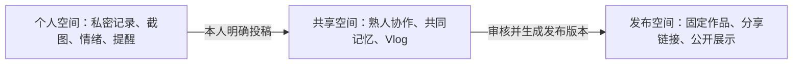
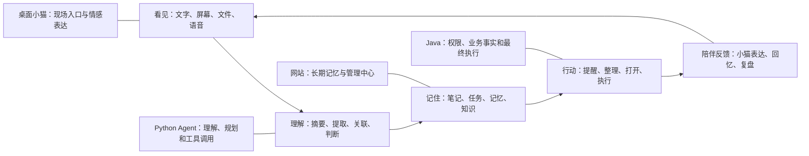

# 猫的角落：产品功能与技术蓝图

文档版本：v1.0  
确定日期：2026-09-18  
文档定位：产品长期总纲、功能边界与技术演进依据

## 1. 文档目的

本文用于统一“猫的角落”的产品方向、功能版图、技术栈、架构边界、实现阶段与长期目标。

本文不是当前完成情况的替代说明：

- 当前真实可运行范围、启动方式和验证结果以 `README.md` 为准。
- 当前接口字段、响应和错误码以 `接口文档.md` 为准。
- 当前技术细节和既有约定以 `桌面猫个人助手-技术栈与架构.md` 为补充。
- 本文描述已经确定的长期方向，但不表示所有功能已经实现，也不要求一次性完成。

后续功能进入开发前，仍需单独明确业务规则、数据模型、接口、隐私边界、失败处理和验收标准。

## 2. 产品定位

“猫的角落”不是普通知识库附带一只桌面宠物，也不是给桌面宠物简单接入一个聊天模型。产品的最终定位是：

> 一个以个人与共同记忆为核心，以网站承载长期数据，以桌面小猫连接现实使用现场，以 AI Agent 提供理解与行动能力的多租户私人数字生活平台。

四个组成部分分别承担不同且不可互相替代的职责：

| 部分 | 核心定位 |
| --- | --- |
| 网站 | 长期记忆、完整管理、共同创作和隐私控制中心 |
| 桌面小猫 | 现场入口、低打扰陪伴、主动反馈和情感表达载体 |
| Java 业务平台 | 用户、权限、业务事实、事务规则和最终执行权 |
| Python AI 平台 | Prompt、模型调度、内容理解、RAG、规划和 Agent 规则 |

没有网站，小猫容易成为短期新鲜感；没有小猫，网站容易成为另一个缺乏持续使用动力的记录工具。网站是基石，小猫是核心体验中不可替代的一环，AI Agent 负责把当下场景和长期记忆连接起来。

产品的一句话定义：

> 网站是用户的第二记忆，小猫是第二记忆伸到现实桌面上的眼睛、爪子和情感。

## 3. 产品原则

### 3.1 记忆属于用户

- 用户原始内容是业务事实，AI 摘要、切片、向量和推断均为可重建数据。
- 不默认把每次聊天、情绪、截图或桌面交互写入长期记忆。
- 内容进入长期记忆、RAG、共享空间或公开发布必须具有明确触发和可撤销控制。
- 用户能够查看来源、修改内容、撤回授权、导出和删除数据。

### 3.2 AI 提议，业务裁决

- Python 可以理解内容、生成建议、规划工具调用。
- Java 必须重新校验用户身份、空间归属、数据状态、版本、权限和确认要求。
- 模型输出不得直接修改业务数据库。
- 删除、发送、发布、完成任务、修改共享作品等高影响操作必须由 Java 执行，并按风险要求获得用户确认。

### 3.3 私密优先，分享是显式动作

- 个人内容默认只存在于个人空间。
- 熟人关系不等于默认授权。
- 私人内容只能由本人明确投稿到共享空间。
- 公开发布使用独立发布版本，不直接暴露私人或共享空间的可变原始数据。

### 3.4 陪伴不制造压力

- 喂食、亲密度和小猫表现不绑定任务完成奖励。
- 不通过连续打卡、惩罚、焦虑提示迫使用户使用。
- 主动陪伴应低频、可拒绝、可暂停，并尊重安静时间。
- 小猫要懂得何时出现，也要懂得何时保持安静。

### 3.5 先解决真实问题，再增加架构复杂度

- 简单业务继续使用直接、清晰的 CRUD。
- 复杂规则出现后渐进式引入 DDD。
- 先保持模块化单体，再根据真实部署和团队边界判断是否拆服务。
- 不因为功能“可能会做大”就提前引入 Kubernetes(k8s)、Kafka、微前端或独立向量数据库。

## 4. 多租户与空间模型

本项目是多租户系统，但早期用户通过邀请加入，彼此多为认识的朋友、家人或合作伙伴。产品不以陌生人公共社交广场作为初期目标。

面向用户使用“空间”作为领域语言，技术层仍执行严格的租户隔离。

### 4.1 三层空间



#### 个人空间

每个用户注册后自动拥有一个个人空间，默认私密，主要保存：

- 文章、日记、心得和开发记录。
- 每日情绪和私人对话。
- 屏幕截图、页面摘录和工作会话。
- 私人照片、视频、语音和文件。
- 个人提醒、任务和日程。
- 个人 RAG 索引和长期记忆。

#### 共享空间

用户通过邀请创建或加入共享空间，例如：

- 一次旅行或聚会。
- 家庭与宠物成长记录。
- 宿舍、朋友小组。
- 学习小组。
- 共同项目。
- 一支多人 Vlog。
- 某个长期挑战或年度回忆。

共享空间只允许访问已经进入该空间的内容，不能跨越到成员个人空间或其他共享空间。

#### 发布空间

发布空间保存经过审核的独立作品版本，支持：

- 指定用户访问。
- 空间成员访问。
- 限时或带密码链接。
- 公开展示。
- 下载和评论权限控制。
- 分享链接撤销和重新生成。

发布内容不直接查询私人原始内容。共享空间发生后续修改时，已经发布的版本保持稳定；需要更新时重新生成发布版本。

### 4.2 成员与角色

目标角色模型：

| 角色 | 权限范围 |
| --- | --- |
| Owner | 空间所有权、成员管理、删除空间和最终发布 |
| Admin | 成员与内容管理，不能转移所有权 |
| Editor | 编辑共享内容和作品 |
| Contributor | 投稿并管理自己的贡献 |
| Viewer | 查看允许访问的内容 |

早期可以合并部分角色，但数据模型和权限判断必须允许后续细分。

### 4.3 数据归属基础字段

所有用户或空间所有的数据都必须具有明确归属，至少表达：

```text
space_id       数据所属空间
created_by     创建用户
version        并发控制版本
created_at     创建时间
updated_at     更新时间
deleted_at     逻辑删除时间（需要时）
```

对外可见内容还需表达：

```text
visibility     PRIVATE / SPACE / LINK / PUBLIC
published_by   发布人
published_at   发布时间
```

客户端传入的 `space_id` 不能作为授权依据。Java 根据登录用户、成员关系和当前请求建立可信的空间上下文，并在所有查询和写操作中保留空间条件。

## 5. 产品能力闭环



所有重要功能都应能说明自己属于闭环的哪一段，并最终减少用户负担或增加有意义的陪伴感。

## 6. 当前实现基线

截至 2026-09-18，项目已经具备以下可运行基础：

- Vue 3 网站和 Electron Windows 桌面小猫。
- Spring Boot + 原生 MyBatis + PostgreSQL 后端。
- 小猫资料管理和 SSE 同步。
- 个人文章 CRUD、分页、分类和文字回忆轮播。
- 最近一年写作足迹。
- 每日情绪快速记录和网站按日期追溯。
- 一次性提醒的创建、修改、完成、删除、桌面缓存和到期提醒。
- 小猫活动、对话、真实猫叫、窗口移动、托盘、位置记忆和 Windows 安装包。

以下重要能力尚未实现：

- 登录、用户、空间与多租户隔离。
- 正式公网部署。
- Python AI 服务、RAG 与 Agent。
- 屏幕理解和统一收集箱。
- 图片、音频、视频与对象存储。
- 共享空间、协作、共同 Vlog 和发布。
- 完整自动更新、代码签名、监控和生产备份。

## 7. 网站功能版图

网站是产品基石，负责所有内容的完整查看、管理、组织、审核和隐私控制。长期形成以下区域。

### 7.1 今日

- 今日提醒和未完成事项。
- 当天情绪时间线。
- 正在进行的工作或学习会话。
- 小猫建议但尚未确认的内容。
- 最近活动的个人和共享项目。
- 早晨简报和晚间复盘草稿。

### 7.2 统一收集箱

统一接收尚未正式归档的内容：

- 临时文字。
- 当前页面摘录。
- 截图和选区。
- 网页链接。
- 文件。
- 语音想法。
- 小猫识别出的待办。
- AI 建议的笔记、标签、关联和长期记忆。

AI 可以建议去向，但未经用户确认不能把内容自动变成正式文章、任务、长期记忆或共享投稿。

### 7.3 记录与记忆库

- 日记、心得、实习和开发记录。
- 图片、视频、语音、喜欢的话和网页摘录。
- 按时间、项目、主题、人物和来源查看。
- 文章回忆、图片回忆和“去年的今天”。
- 带来源引用的个人知识问答。
- 原文、AI 整理结果和索引状态分开展示。

### 7.4 项目空间

用户可以为长期事项建立项目，例如学习 DDD、开发桌面猫、旅行计划或找工作。项目空间聚合：

- 文章和笔记。
- 页面摘录、截图和文件。
- 待办与提醒。
- 决策记录。
- AI 对话。
- 工作会话。
- 时间线和阶段总结。

### 7.5 AI 问答

- 检索用户明确允许 AI 使用的内容。
- 答案展示来源、相关片段和原文入口。
- 没有依据时明确说明未找到。
- 支持限定个人空间、共享空间、项目、时间和内容类型。
- 不允许一个空间的问答隐式检索另一个空间的数据。

### 7.6 Agent 中心

- 内置工具列表和每个工具的权限。
- 本次允许、每次询问、始终允许、始终禁止。
- Agent 运行历史、调用步骤、结果和失败原因。
- 使用的模型、Prompt 版本、Token、耗时和费用。
- 高影响操作的确认与撤销记录。

### 7.7 隐私中心

- 小猫在什么时间读取了什么内容。
- 是否保存过截图、OCR 文本或摘要。
- 哪些内容发送给了哪个模型。
- 应用、网站和目录黑名单。
- 暂停捕获和安静时间。
- 数据保留时长、批量删除、导出和撤销授权。
- 个人、共享和公开可见性检查。

### 7.8 设备中心

- 已登录的 Web、桌面和未来移动设备。
- 设备最近在线时间和同步状态。
- 远程注销。
- 桌面客户端版本和升级状态。
- 本地缓存与离线能力说明。

### 7.9 小猫空间

- 名字、形象、主题和动作包。
- 主动程度、关心频率和安静时间。
- 是否允许使用当天情绪、提醒和个人记忆。
- 不同场景下的表达风格。
- 共享空间中的小猫展示和猫邮差设置。

## 8. 桌面小猫能力

小猫不是网站功能的缩小版，也不承载复杂管理界面。它主要承担快速输入、现场感知、适时行动和情感化反馈。

### 8.1 “指给小猫看”

用户可以：

- 点击“看看这里”读取当前窗口。
- 框选屏幕区域后交给小猫。
- 把文字、图片、文件或链接拖到小猫身上。
- 直接对当前内容提问。

小猫可以提供：

```text
解释｜记笔记｜建提醒｜保存摘录｜关联项目｜投稿共享空间｜仅问一次
```

典型问题：

- “帮我记住这个。”
- “这段是什么意思？”
- “把这里的任务提出来。”
- “这个错误以前遇到过吗？”
- “把这页整理成学习笔记。”
- “比较一下这个页面和昨天保存的版本。”
- “记住这句话，但不要保存整张截图。”

### 8.2 屏幕读取优先级

不把截图加视觉模型当作唯一方案，按结构化程度优先：

```text
用户选中文字或浏览器 DOM
→ Windows UI Automation 可访问性文本
→ OCR
→ 多模态视觉模型
```

这样可以提高文字准确性、减少模型费用，并降低整张屏幕外泄的风险。

### 8.3 工作与学习会话

用户主动开始“陪我工作”或“陪我学习”：

- 只观察用户选择的应用、窗口或项目。
- 收集用户主动标记的页面、截图、文件和问题。
- 暂存本次会话中的上下文。
- 提取可能的任务、陌生概念、错误和决策。
- 会话结束后生成可编辑的会话胶囊。

会话胶囊包括：

```text
做了什么
学到了什么
遇到了什么问题
做了什么决定
还有什么没完成
引用了哪些页面和文件
```

### 8.4 编程陪伴

- 识别截图中的错误信息。
- 搜索过去遇到过的同类问题。
- 保存错误、原因和解决方案。
- 根据 Git diff 生成开发日志草稿。
- 从讨论中提取技术决策。
- 将 TODO 转为项目待办。
- 结束工作时生成“今天改了什么”。

该能力用于跨 IDE、浏览器、终端和项目文档形成个人开发记忆，不替代 IDE 内的编程助手。

### 8.5 学习陪伴

- 解释当前段落。
- 提取陌生概念。
- 生成学习笔记和少量复习卡片。
- 关联过去学过的内容。
- 记录尚未理解的问题。
- 在合适时间由小猫叼回复习内容。

### 8.6 温和的主动陪伴

在用户明确授权后，小猫可以综合：

- 连续工作时长。
- 长时间停留在同一错误或页面。
- 提醒被多次延后。
- 当天主动记录的情绪。
- 用户设置的安静时间。
- 最近已经主动打扰的次数。

给出低频、可拒绝的表达，例如：

- “你在这里停了挺久，要不要让我记一下问题？”
- “这件事改过几次时间了，要不要重新拆小一点？”
- “今天推进了不少，需要我帮你收个尾吗？”
- “我先在旁边睡一会儿，需要时再叫我。”

### 8.7 猫邮差与共同体验

- 把用户明确选择的照片、文字或语音送入共享空间。
- 收到熟人投稿、评论和审核请求时带来通知。
- 支持给指定用户发送一条内容或小猫爪印。
- 在共同作品中展示不同成员的小猫和贡献来源。
- 在纪念日把过去的共同回忆带回来。

## 9. 个人记忆与 Agent 能力

### 9.1 个人记忆搜索

支持用户询问：

- “我之前在哪里见过这个错误？”
- “上个月为什么决定把 AI 和 Java 隔离？”
- “我保存过哪些关于 DDD 的资料？”
- “最近有哪些答应过但还没做的事情？”
- “帮我找到那张黑猫躺在窗边的照片。”

回答必须能够回到文章、截图、文件、会话或共享素材的真实来源。

### 9.2 决策记录

当用户比较技术、商品或方案时，系统可以建议建立决策记录：

- 候选方案。
- 优缺点。
- 最终选择。
- 选择原因。
- 适用前提。
- 后续复盘时间。

### 9.3 每日简报与复盘

早晨可以生成：

- 今日提醒。
- 昨日未完成事项。
- 最近推进的项目。
- 一条用户允许展示的回忆。
- 基于用户当前计划的重点建议。

晚上生成可编辑草稿，不直接保存为正式日记：

```text
今天主要做了什么
完成了什么
在哪些事情上投入较多
记录了哪些想法
还有哪些事情没有结束
```

### 9.4 情绪理解

- 只读取用户主动记录且明确允许本功能使用的内容。
- 可以描述当天记录中可观察的变化，不进行医学或心理诊断。
- 不使用疾病标签，不推断用户未表达的事实。
- 分析结果说明依据，并允许关闭、删除或不保存。
- 模型失败不影响原始情绪记录。

## 10. 共享空间与共同 Vlog

### 10.1 共同 Vlog 的定位

第一阶段不制作完整专业视频编辑器，而是制作“多人共同收集素材，由 AI 形成故事草案，再通过模板生成成片”的共同创作能力。

### 10.2 创建共同经历

示例：

```text
项目：杭州周末旅行
时间：2026-10-01 ～ 2026-10-03
成员：受邀请的朋友
目标成品：60 秒竖屏 Vlog
```

创建者可以设置主题、时间范围、成员、素材类型、成片比例、可见范围和审批规则。

### 10.3 独立投稿

成员可以投稿：

- 照片和视频片段。
- 一句话和短记录。
- 语音。
- 截图和网页摘录。
- 地点和时间。
- 当天感受。
- 字幕、旁白和音乐建议。

素材首先属于个人。只有点击投稿后才进入共享空间，并显示贡献者和授权状态。

成员可以在发布前撤回自己的投稿。已经发布的作品是否需要下架或重新渲染，由空间规则和发布授权共同决定。

### 10.4 AI 故事草案

Python AI 平台负责：

- 按时间和地点整理素材。
- 聚合同一事件的不同成员视角。
- 识别重复或质量较低的片段。
- 生成标题、章节、故事板、字幕和旁白草稿。
- 建议片段长度和转场。
- 生成轻松、温馨、纪实等多个叙事方案。

AI 只能生成草案，不能自行公开、删除或替换成员素材。

### 10.5 协作流程

```text
草稿
→ 成员评论
→ 素材确认
→ 主编调整
→ 按规则批准
→ 生成成片
→ 发布
```

初期采用一个主编持有编辑权、其他成员评论和提出建议的模式，通过版本和编辑锁避免冲突；暂不实现类似在线文档的多人实时视频时间线。

### 10.6 模板化成片

初期支持：

- 15 秒、30 秒和 60 秒模板。
- 横屏、竖屏和方形比例。
- 固定转场和片尾。
- 字幕和封面。
- 简单背景音乐。
- 图片轻微移动效果。
- 成员名单和小猫形象。

Java 管理项目、权限、版本和审批；Python 生成故事板及渲染参数；媒体 Worker 使用 FFmpeg 执行转码和合成。

### 10.7 分享能力

- 指定用户或空间成员查看。
- 带到期时间的分享链接。
- 可选密码、下载权限、评论权限和访问次数限制。
- 随时撤销或重新生成链接。
- 记录发布人、版本和访问审计。

## 11. 其他共享能力

### 11.1 共同旅行

- 行程、地点收藏和出发提醒。
- 成员各自想去的地方。
- 旅行中的照片、短记和语音。
- 自动生成游记、地图和共同 Vlog。

### 11.2 家庭与宠物记忆

- 家庭相册。
- 宠物成长记录。
- 生日和纪念日。
- 长辈语音故事。
- 家庭年度回忆。

### 11.3 共同学习

- 共享资料和成员笔记。
- AI 汇总不同理解。
- 共同问题清单和复习计划。
- 阶段总结和学习过程 Vlog。

### 11.4 共同项目

- 项目任务、资料和时间线。
- 决策记录和开发日志。
- 阶段总结、周报和项目纪录片。

### 11.5 共同挑战

- 一起早睡、阅读、学习或记录生活。
- 小猫提供轻量提醒、鼓励和共同回顾。
- 不引入惩罚性连续打卡和排名压力。

## 12. Agent 工具与权限

### 12.1 读取型工具

可以较早实现：

- 读取用户选中的文字。
- 捕获当前窗口或指定区域。
- 读取当前应用和窗口标题。
- 读取用户拖入的文件。
- 搜索当前空间允许访问的文章、笔记和提醒。
- 获取当前时间、天气和日历。
- 查找用户明确授权目录中的文件。
- 获取当前项目的 Git 状态。

### 12.2 草稿型工具

- 生成笔记、提醒、日记或消息草稿。
- 生成项目总结和决策记录草稿。
- 建议标签、空间和内容关联。
- 建议某段内容进入长期记忆或共享空间。

草稿不会自动成为正式业务数据。

### 12.3 执行型工具

- 创建、修改、完成提醒。
- 创建正式文章。
- 修改日历。
- 发送邮件或消息。
- 发布作品。
- 移动或删除文件。
- 操作浏览器或执行系统动作。

执行型工具必须由 Java 再次鉴权、校验业务状态，并根据风险要求用户确认。初期不向模型开放任意 Shell、任意 SQL 或任意网络访问。

### 12.4 权限等级

```text
只读，可直接使用
只生成草稿
每次执行前询问
本次会话允许
始终允许
始终禁止
```

权限需要区分用户、设备、空间和工具，所有调用写入可查询的 Agent 运行记录。

## 13. 屏幕能力的隐私边界

屏幕内容可能包含密码、支付信息、通信内容和其他人的隐私，必须坚持：

- 默认关闭，由用户主动开启。
- 优先读取当前窗口、选区或选中文字，不默认截取整个桌面。
- 捕获状态必须持续可感知，并提供一键暂停。
- 支持应用、网站和目录黑名单。
- 密码管理器、支付页面、无痕窗口和受保护内容默认禁止。
- 优先在本地提取文本和进行敏感信息过滤。
- “仅问一次”模式不保留原图和长期索引。
- 保存前允许预览、裁剪和遮挡敏感区域。
- 截图、OCR 文本、摘要和向量分别设置保留策略。
- 支持按时间、应用、网站和空间删除。
- 连续屏幕历史属于后期独立功能，不作为第一版截图 Agent 的默认行为。

## 14. Java 与 Python 的边界

### 14.1 总原则

> Java 拥有业务事实和最终执行权；Python 拥有 AI 推理、Prompt、检索和模型调度权。

| 能力 | Java | Python |
| --- | --- | --- |
| 用户、登录、设备和空间权限 | 负责 | 不负责 |
| 文章、情绪、提醒和共享作品状态 | 负责 | 不直接修改 |
| 事务、乐观锁、审计和发布 | 负责 | 不负责 |
| Prompt 模板与版本 | 不保存业务实现 | 负责 |
| 模型供应商 API | 不接入 | 负责 |
| 模型选择、降级和预算 | 不负责 | 负责 |
| 分块、Embedding、检索和重排 | 提供授权来源 | 负责 |
| 短期推理上下文 | 不负责 | 负责 |
| 用户可见正式会话记录 | 负责 | 返回结果 |
| 工具调用规划 | 接收请求 | 负责 |
| 工具真正执行 | 负责 | 不直接执行 |
| AI 评测、Token、耗时和模型效果 | 保存必要汇总 | 负责详细记录 |

### 14.2 规则区分

属于 Python 的规则：

- 使用哪个 Prompt 和模型。
- 什么情况下进行 RAG、重排或降级。
- 如何组织上下文、引用、字幕和故事板。
- 什么情况下拒绝心理诊断或不当请求。
- 是否提出工具调用。

属于 Java 的规则：

- 当前用户是否拥有或能访问数据。
- 提醒能否完成、版本是否一致。
- 内容是否允许进入 RAG 或共享空间。
- 谁可以编辑、审核和发布共同作品。
- 删除、发送和发布是否已经确认。

判断标准：

> 涉及“系统应该怎样推理”的规则放 Python；涉及“业务是否允许这样做”的规则放 Java。

### 14.3 防腐层

Python 不能直接使用 Java 领域对象，也不能让模型返回的 JSON 直接成为领域操作：

```text
Python Tool Request
→ Java AI 防腐层
→ 转换为 Application Command
→ 领域模型和权限重新校验
→ 执行或拒绝
```

### 14.4 数据库隔离

初期使用同一个 PostgreSQL 实例、不同 Schema 和数据库角色：

```text
app.*    Java 业务数据
ai.*     Python 索引、Prompt、评测和推理记录
```

- Python 账号不能直接修改或任意读取 `app` Schema。
- Python 通过 Java 内部接口获取已经授权的原文或素材。
- Java 不直接写入 Python 的向量和推理内部表。
- 模型密钥只存在于 Python 服务的密钥配置中。

## 15. 关键数据流

### 15.1 同步推理

```text
客户端
→ Java 鉴权和确定空间范围
→ Python 内部推理接口
→ 模型、RAG 或工具规划
→ Java 转发流式结果
→ 客户端
```

流式事件可以包括：

```text
response.started
response.delta
citation.added
tool.requested
usage.updated
response.completed
response.failed
```

客户端始终只访问 Java，不直接访问 Python。

### 15.2 异步索引

```text
Java 提交业务数据和 Outbox 事件
→ 后台可靠投递
→ Python 获取经过授权的指定版本原文
→ 分块和向量化
→ 写入 ai Schema
→ 返回索引状态
```

事件需要包含：

```text
eventId
spaceId
sourceType
sourceId
sourceVersion
eventType
ragEnabled
occurredAt
```

Python 按 `eventId` 幂等处理，并防止旧版本索引覆盖新版本。

初期使用事务 Outbox、Java 后台投递、HTTP 和重试，不先引入消息队列。服务和事件量增加后再考虑 RabbitMQ。

### 15.3 共同 Vlog

```text
成员上传或投稿素材
→ Java 保存归属、授权和媒体元数据
→ 对象存储保存原文件
→ Python 理解素材并生成故事板
→ 成员审核和主编调整
→ 媒体 Worker 使用 FFmpeg 渲染
→ Java 创建固定发布版本
→ 分享或公开展示
```

## 16. 渐进式 DDD

### 16.1 演进原则

```text
简单 CRUD
→ 按业务能力划分模块
→ 模块内区分应用、领域和基础设施
→ 引入聚合、值对象和领域事件
→ 模块通过接口与事件协作
→ 真实需要出现后再考虑拆服务
```

DDD 用于处理持续演化的复杂业务，不通过批量创建空类或更换名词证明已经实施。

### 16.2 保持简单 CRUD 的模块

- 简单小猫资料。
- 普通个人设置。
- 静态配置。
- 没有复杂状态变化的基础数据。

### 16.3 重点领域化的模块

- 重复提醒、稍后提醒、错过恢复和多设备协调。
- 个人记忆授权、内容版本、索引状态和引用。
- 陪伴行为、主动程度、冷却和状态联动。
- 空间成员、投稿、撤回、协作和发布审批。
- 共同 Vlog 的素材、故事板、版本和发布流程。
- Agent 工具权限、确认和执行审计。

### 16.4 候选限界上下文

| 上下文 | 主要概念 |
| --- | --- |
| Identity | 用户、登录、设备、凭证 |
| Space | 个人空间、共享空间、成员、邀请、角色 |
| Memory | 文章、情绪、摘录、长期记忆、RAG 授权 |
| Planning | 任务、提醒、重复规则、完成和稍后提醒 |
| Companion | 小猫资料、活动、行为和陪伴状态 |
| Contribution | 投稿、撤回、素材授权和贡献者 |
| Media | 图片、视频、音频、对象存储和转码 |
| Story | Vlog 项目、故事板、时间线和版本 |
| Collaboration | 评论、建议、审核和编辑锁 |
| Publication | 发布版本、分享链接和访问策略 |
| Conversation | 用户可见会话、消息和保留策略 |
| Notification | 桌面、站内、邮件和推送 |
| AI Intelligence | Python Prompt、RAG、模型与工具规划 |

这些上下文按功能复杂度逐步形成，不要求一次性全部建包。

### 16.5 复杂 Java 模块目标结构

```text
planning/
  interfaces/
    rest/
      ReminderController
      dto/
  application/
    ReminderApplicationService
    command/
    query/
  domain/
    Reminder
    ReminderSchedule
    RecurrenceRule
    ReminderRepository
    event/
  infrastructure/
    persistence/
      ReminderDao
      ReminderDO
      ReminderDao.xml
    event/
```

MyBatis 继续负责持久化。只有领域模型确实需要与数据模型隔离时才引入领域 Repository 及基础设施适配器，不能为了形式增加简单转发层。

### 16.6 明确避免伪 DDD

- 不把每张数据库表都做成聚合根。
- 不把所有基础类型机械包装成值对象。
- 不要求简单查询加载完整聚合。
- 不把 DAO 改名为 Repository 就声称完成 DDD。
- 不为每一个 CRUD 事件建立领域事件。
- 不因为 DDD 禁止 MyBatis。
- 不提前引入事件溯源。
- 不把模块化单体立即拆成大量微服务。

## 17. 目标技术栈

### 17.1 Web 与桌面端

| 技术 | 决策 |
| --- | --- |
| Vue 3 | 网站和 Electron 渲染界面 |
| TypeScript | 前端、桌面和共享类型的基础语言 |
| Vite | Web 构建 |
| Vue Router | 页面路由 |
| Pinia | 客户端本地状态与偏好 |
| TanStack Query for Vue | 后续承担服务端数据缓存、失效和重试 |
| Electron | Windows 桌面小猫和系统能力 |
| electron-vite | Electron 构建 |
| electron-builder | Windows 安装包和更新产物 |
| pnpm workspace | 前端工作区和依赖管理 |

桌面端上线后必须补齐代码签名、自动更新、崩溃记录和安全基线。完整离线编辑出现后再从 JSON 缓存演进到 SQLite、Outbox 和冲突处理。

### 17.2 Java 业务平台

当前基线：

```text
JDK 21
Spring Boot 3.5
原生 MyBatis 3
Flyway
Maven Wrapper
```

长期目标：

```text
Java 25 LTS
Spring Boot 4
Spring Security
Spring Modulith
原生 MyBatis 4
Flyway
OpenAPI
Micrometer + OpenTelemetry
```

升级需要单独迁移、完整测试和依赖兼容验证，不因为本文确定长期方向就立即升级当前可运行基线。

### 17.3 Python AI 平台

必须栈：

```text
Python 3.13+
FastAPI
Pydantic 2
HTTPX
uv + uv.lock
PostgreSQL + pgvector
Alembic
模型供应商官方 SDK
OpenTelemetry
pytest
```

建议目录：

```text
services/ai/
  app/
    api/               # Java 调用的内部接口
    prompts/           # Prompt 模板和版本
    policies/          # AI 行为、安全与输出规则
    providers/         # 模型供应商适配
    routing/           # 模型选择、降级和预算
    retrieval/         # 分块、检索、重排和引用
    agents/            # 多步骤推理和工具规划
    tools/             # Java 工具客户端定义
    memory/            # 临时推理上下文
    evaluation/        # 评测数据集和结果
    observability/     # Token、费用、耗时和调用链
```

初期不把 LangChain、LlamaIndex、LangGraph 或 LiteLLM 作为强制基础依赖：

- 模型供应商增多后可以评估 LiteLLM。
- 真正出现多步骤、有状态 Agent 后可以评估 LangGraph。
- 大量异步 AI 任务出现后可以评估 Celery + RabbitMQ。
- 需要本地模型时可以评估 Ollama 或 vLLM。

Java 不引入 Spring AI，模型 SDK 和 Prompt 不进入 Java 业务平台。

### 17.4 数据与搜索

| 技术 | 用途 |
| --- | --- |
| PostgreSQL | 业务事实、空间、权限、任务和协作 |
| Flyway | Java 业务 Schema 迁移 |
| Alembic | Python AI Schema 迁移 |
| PostgreSQL 全文检索 | 关键词和结构化文本搜索 |
| pgvector | 向量和相似度检索 |
| S3 兼容对象存储 | 图片、视频、音频、附件和发布产物 |

当前 PostgreSQL 16 可以继续使用。生产环境升级到更新受支持版本时单独验证备份、扩展和迁移；个人和早期熟人规模不引入独立向量数据库或 OpenSearch。

### 17.5 媒体处理

| 技术 | 用途 |
| --- | --- |
| FFmpeg / FFprobe | 视频转码、合成、截图和元数据 |
| 对象存储预签名上传 | 大文件安全上传和下载 |
| 媒体 Worker | 缩略图、转码和 Vlog 渲染 |

媒体处理达到独立资源需求后，从 Python AI 服务中拆出 `services/media-worker`，避免模型推理和视频转码互相影响。

### 17.6 API、事件与实时通信

| 场景 | 方案 |
| --- | --- |
| 客户端访问 Java | HTTPS + REST JSON |
| Java 对客户端流式输出 | SSE |
| Java 调用 Python | 私有网络 HTTP + 流式响应 |
| Electron 系统能力 | preload + IPC |
| 接口契约 | OpenAPI + 生成 TypeScript Client |
| 业务异步任务 | PostgreSQL 任务表与事务 Outbox |
| 后续可靠消息 | 达到真实需求后使用 RabbitMQ |

WebSocket 只在真正需要双向实时语音、在线状态或实时协作时引入。

### 17.7 测试

```text
Java：JUnit 5 + Spring Boot Test + Testcontainers
Web：Vitest + Vue Test Utils
端到端：Playwright
Python：pytest
接口：OpenAPI 契约测试
媒体：固定素材和产物元数据验证
AI：固定评测集、引用正确率和回归评测
```

### 17.8 部署与可观测性

初期生产架构：

```text
Ubuntu Server
Nginx + HTTPS
Docker Engine
Docker Compose
Java 容器
Python AI 容器
PostgreSQL
对象存储
媒体 Worker（对应阶段增加）
```

可观测性：

```text
Spring Actuator
Micrometer
OpenTelemetry
Prometheus
Grafana
Loki
Tempo
```

早期可以使用托管错误监控减少运维，但日志、指标和 Trace 必须统一携带 `requestId`，跨 Java、Python 和 Worker 关联。

## 18. 上线安全与运维基线

项目确定上线，因此以下能力属于必须项：

### 18.1 身份与会话

- Spring Security。
- 邀请制注册和登录。
- Web 使用安全的 HttpOnly、Secure Cookie。
- Electron 使用适合桌面端的设备授权或 OAuth2/OIDC + PKCE，不在安装包内保存固定密钥。
- 设备列表、远程注销和异常登录记录。

### 18.2 应用安全

- HTTPS、CORS、CSRF 和 CSP。
- 登录、上传、分享和 AI 接口限流。
- 文件大小、扩展名、MIME 和真实内容校验。
- Electron 启用上下文隔离、沙箱、IPC 白名单和发送方校验。
- 敏感操作审计。
- 依赖漏洞扫描和及时安全升级。

### 18.3 数据安全

- PostgreSQL 不向公网开放。
- 密码、模型 Token 和对象存储凭证通过生产密钥配置注入。
- 数据库与对象存储自动异地备份。
- 定期执行真实恢复演练。
- 个人内容不写日志；日志只记录标识、状态、长度和必要元数据。
- 公开发布前检查个人信息和敏感内容。

### 18.4 版本兼容

- 正式 API 使用 `/api/v1` 等稳定版本边界。
- 服务端兼容仍在使用的桌面客户端版本。
- 数据库迁移采用先扩展、再切换、最后清理。
- Electron 提供自动更新和 Windows 代码签名。
- 发布失败时保留可快速回滚的镜像和数据库迁移方案。

### 18.5 CI/CD

```text
类型检查
→ 单元测试
→ PostgreSQL 集成测试
→ Web 端到端测试
→ Java / Web / Electron / Python 构建
→ 漏洞扫描
→ 构建固定版本镜像
→ 部署测试环境
→ 数据库迁移检查
→ 生产部署
→ 健康检查
→ 保留回滚版本
```

## 19. 开放平台方向

“开放”分成两个不同阶段。

### 19.1 内容分享平台

近期重点是：

- 熟人邀请和共享空间。
- 共同记忆、相册和 Vlog。
- 可控的链接分享和公开作品页。
- 不建立陌生人信息流、热榜、粉丝和算法推荐。

### 19.2 Agent 扩展平台

在内置 Agent 工具稳定后，可以允许开发者或高级用户扩展：

- Tool Manifest 和 JSON Schema。
- 明确的 OAuth Scope。
- Webhook 和回调。
- 工具审批与权限展示。
- 工具运行隔离、超时和审计。
- Prompt、工作流和 Vlog 模板分享。

第一阶段只允许官方内置工具，不开放任意脚本、Shell、数据库或不受控网络能力。

## 20. 分阶段实现路线

### 阶段 0：现有基础闭环（已完成）

- 网站、Java 后端和 Electron 桌面猫。
- 小猫资料、文章、写作足迹、文字回忆、每日情绪和一次性提醒。
- PostgreSQL、Flyway、MyBatis、SSE 和桌面缓存。

### 阶段 1：上线与多租户基础

目标：从个人本机应用转为可安全上线的邀请制多租户产品。

- 用户、登录、设备和邀请。
- 个人空间、可信空间上下文和数据归属。
- 将现有数据回填给初始用户和个人空间。
- Spring Security 和生产会话。
- API 版本化和 OpenAPI。
- Docker Compose、Nginx、HTTPS、备份、监控和 CI/CD。
- S3 兼容对象存储基础。

### 阶段 2：统一收集与“指给小猫看”

目标：形成产品的第一个高价值 Agent 入口。

- 当前窗口、屏幕选区、选中文字和文件拖入。
- UI Automation、OCR 和视觉模型分级读取。
- 解释、记笔记、建提醒、保存摘录和仅问一次。
- 网站统一收集箱。
- 捕获提示、黑名单、预览、遮挡、保留和删除。

### 阶段 3：共享空间与熟人协作

目标：从个人记忆扩展到共同记忆。

- 创建空间、邀请成员和角色。
- 投稿、撤回、评论和审核。
- 共享相册和共同时间线。
- 猫邮差和小猫投稿入口。
- 指定用户、空间成员和限时链接分享。

### 阶段 4：Python AI、RAG 与工作会话

目标：让小猫能够理解当下，并从长期记忆中找回依据。

- Python FastAPI AI 服务。
- Prompt、模型路由和调用记录。
- app/ai Schema 隔离。
- 事务 Outbox 和可重建索引。
- PostgreSQL 全文检索 + pgvector 混合检索。
- 带来源问答。
- 工作和学习会话胶囊。
- 决策记录、每日简报和晚间复盘草稿。

### 阶段 5：共同 Vlog

目标：把多人素材转化成可审核、可发布的共同故事。

- Story 项目和成员投稿。
- AI 素材理解和故事板。
- 主编编辑锁、评论和审批。
- FFmpeg 模板化渲染。
- 固定发布版本、分享链接和公开作品页。
- 共同回忆和周年唤醒。

### 阶段 6：Agent 行动与开放能力

目标：从“理解与记录”演进到受控行动。

- 完整工具权限和运行历史。
- 日历、邮件、浏览器、文件和项目工具连接。
- 高影响操作确认和撤销策略。
- Agent 模板、工作流和受控扩展能力。
- 根据真实需求评估 LangGraph、LiteLLM 和 RabbitMQ。

### 阶段 7：跨设备与高级能力

- PWA 或 Capacitor 移动端。
- 桌面完整离线编辑、SQLite 和同步冲突处理。
- 语音输入、转写和小猫语音输出。
- 本地模型与隐私模式。
- 更丰富的小猫角色、行为和共享空间表现。

阶段顺序是当前建议，可以根据真实用户反馈调整，但多租户和上线安全必须早于共享内容和公开发布。

## 21. 当前明确不做或不提前做

- 不立即拆分 Java 业务微服务。
- 不引入 Kubernetes 和服务网格。
- 不引入 Kafka。
- 不引入独立向量数据库。
- 不引入 OpenSearch 或 Elasticsearch。
- 不实现前端微前端。
- 不制作完整专业视频时间线编辑器。
- 不实现陌生人公共信息流和算法推荐。
- 不默认全天候保存屏幕截图。
- 不让 AI 自动形成不可见、不可删除的长期记忆。
- 不开放任意 Shell、SQL 或不受控网络工具。
- 不让 Python 直接修改 Java 业务表。
- 不让共享空间隐式读取成员私人空间。
- 不同时维护 Electron、Tauri、Flutter 多套重复客户端。

## 22. 成功标准

产品是否做对，不以模块数量判断，而以以下结果判断：

- 用户能在几秒内把当前内容交给小猫并形成有来源的记录。
- 用户能够持续在网站找回过去的内容、原因和共同经历。
- AI 回答能够引用真实来源，不把常识冒充个人记忆。
- 私人内容不会因为熟人关系或 Agent 推理发生越权访问。
- 小猫的主动行为有帮助而不打扰。
- 多个成员能够从各自素材完成一份共同作品。
- 用户能够清楚知道 Agent 看过什么、做过什么、为什么这样做。
- 服务上线后具备可恢复备份、监控、版本兼容和安全更新能力。
- 架构复杂度始终与真实业务复杂度匹配。

## 23. 长期目标

长期希望形成的不是一个功能堆叠的工具箱，而是一个能够伴随用户多年积累的生活系统：

- 网站保存个人与共同生活的长期脉络。
- 小猫在用户真实使用电脑的现场提供自然入口。
- AI 帮助理解、关联和找回内容，但不夺走用户对记忆的控制权。
- 熟人可以在明确授权下共同记录、共同创作和共同回忆。
- 每一次公开分享都来自可审计、可撤销的私人到共享再到发布过程。

最终愿景：

> 每个人拥有一只守护私人记忆的小猫；当朋友们进入同一个共享空间，小猫们会把各自主人愿意分享的片段带到一起，共同组成一段有来源、有温度、能够多年后再次找回的故事。

## 24. 参考资料

- [Electron Security](https://www.electronjs.org/docs/latest/tutorial/security)
- [Spring Boot System Requirements](https://docs.spring.io/spring-boot/system-requirements.html)
- [MyBatis Spring Boot Starter](https://mybatis.org/spring-boot-starter/mybatis-spring-boot-autoconfigure/)
- [Spring Modulith](https://docs.spring.io/spring-modulith/reference/)
- [PostgreSQL Versioning Policy](https://www.postgresql.org/support/versioning/)
- [pgvector](https://github.com/pgvector/pgvector)
- [OpenAPI Specification](https://spec.openapis.org/oas/)
- [OpenTelemetry Spring Boot Starter](https://opentelemetry.io/docs/zero-code/java/spring-boot-starter/)
- [Docker Compose Production](https://docs.docker.com/compose/how-tos/production/)
- [Playwright](https://playwright.dev/docs/intro)
- [Microsoft Recall Privacy Controls](https://support.microsoft.com/en-us/windows/privacy/privacy-and-control-over-your-recall-experience)
- [Google Photos Shared Album Controls](https://support.google.com/photos/answer/9789702)
